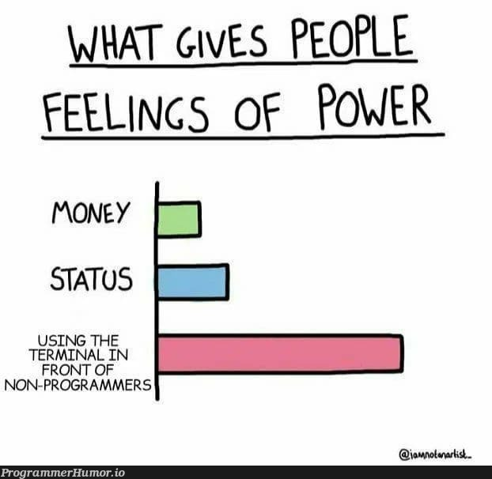
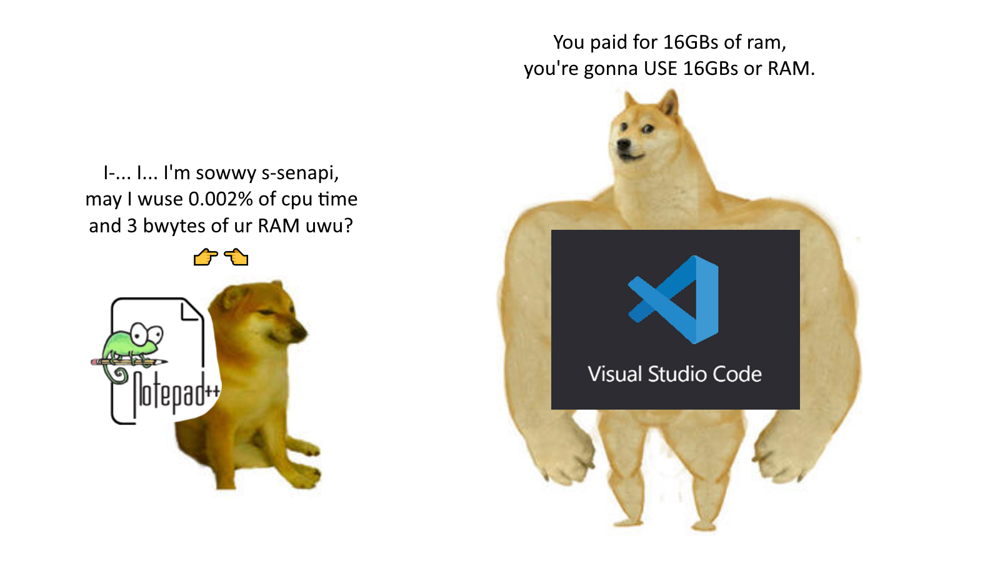
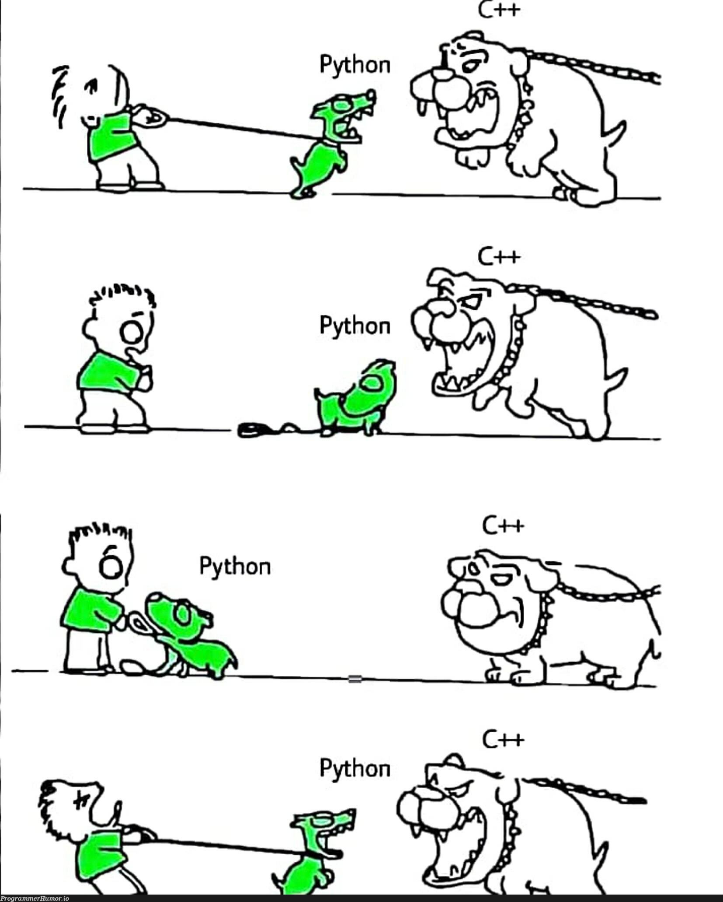

## Foreword

The purpose of this first lecture is to introduce
some basic concepts and tools that are commonly used in
programming and data science. The lecture, originally crafted
by Dr. Franziska Bender, and Dr. Aurélien Sallin, covers the following topics:

- what is the terminal
- set up a basic programming environment with an IDE
- install Python and understand environments

I will also use some memes to make the lecture more engaging and fun :D

## 1. The Terminal

### 1.1. Definition

The terminal, also known as the command line interface (CLI), is a text-based interface that allows users to interact with their computer's operating system. It provides a way to execute commands, navigate the file system, and manage files and directories.
Instead of clicking, we are typing!

{width="40%" fig-align="center"}

- The **shell** is a program that interprets the commands we type in the terminal.
- The **terminal** is the interface that allows us to interact with the shell.

We tend to use the terminal because it is:
- faster for certain tasks
- more precise and reproducible
- easier to automate

### 1.2. On files, paths, and shortcuts

Importantly, the terminal allows us to navigate the file system using commands like `cd` (change directory), `ls` (list files), and `pwd` (print working directory). We can also create, move, and delete files and directories using commands like `mkdir`, `mv`, and `rm`. Below is a quick demo:

```bash
# Create a new directory called "data"
mkdir data

# Change into the "data" directory
cd data

# Create a new file called "gdp.csv"
touch gdp.csv # touch is a command that creates an empty file

# List the files in the current directory
ls

# Remove the file
rm gdp.csv
```

It is also important to understand the concept of paths. A path is a string that specifies the location of a file or directory in the file system. There are two types of paths: absolute and relative.

- An **absolute path** starts from the root directory and specifies the full path to a file or directory. For example, `/home/user/data/gdp.csv` is an absolute path.

- A **relative path** starts from the current working directory and specifies the path to a file or directory relative to the current location. For example, if we are currently in the `/home/user` directory, then `data/gdp.csv` is a relative path to the same file.

### 1.3. Naming Conventions

This is not directly related to the terminal but helps to avoid confusion when navigating the file system. It is important to follow naming conventions for files and directories. Some common conventions are:

1. Snake case: `my_file.py`
2. Camel case: `myFile.py`
3. Kebab case: `my-file.py`

It is good to choose one convention and stick to it for consistency. In Python, the snake case is commonly used for file names and variable names. However, for class names, the Camel case is often used (more on this later).

### 1.4. Additional Commands

Here are some additional commands that can be useful when working with the terminal:

| Command | Description |
| --- | --- |
| `pwd` | Print the current working directory |
| `ls` | List the files in the current directory |
| `cd <directory>` | Change the current directory |
| `mkdir <directory>` | Create a new directory |
| `touch <file>` | Create a new empty file |
| `rm <file>` | Remove a file |
| `rm -r <directory>` | Remove a directory and its contents |
| `cp <source> <destination>` | Copy a file or directory |
| `mv <old-path> <new-path>` | Move a file or directory |
| `cat <file>` | Display the contents of a file |
| `nano <file>` | Open a file in the nano text editor to edit it |


## 2. IDEs

### 2.1. Definition

An **Integrated Development Environment** (IDE) is a software application that provides a comprehensive environment for writing, testing, and debugging code. It typically includes a code editor, a compiler or interpreter, and a debugger. Some popular IDEs for Python include PyCharm, and Visual Studio Code.

{width="70%" fig-align="center"}

## 3. Python and Environments

### 3.1. Python

Python is a high-level, interpreted programming language that is widely used in data science, machine learning, and web development. It is known for its simplicity and readability, making it a great choice for beginners. Python also has a large range of libraries. The most popular ones for data science are:

| Library | Description |
| --- | --- |
| `NumPy` | A library for numerical computing |
| `Pandas` | A library for data manipulation and analysis |
| `Matplotlib` | A library for data visualization |
| `Scikit-learn` | A library for machine learning |
| `TensorFlow` | A library for deep learning |
| `PyTorch` | Another library for deep learning |

The difference between an interpreted and a compiled language is that an interpreted language is executed line by line, while a compiled language is translated into machine code before execution. Python is an interpreted language, which means that it is executed by the Python interpreter. To illustrate the simplicity of Python, here is how you can print "Hello, World!" in Python:

```python
print("Hello, World!")
```

and here is how we could do the same in C++ (a compiled language):

```cpp
#include <iostream>
int main()
{
    std::cout << "Hello, World!" << std::endl;
    return 0;
}
```

However, the disadvantage of interpreted languages is that they can be slower than compiled languages, especially for computationally intensive tasks. For instance, in quantitative finance, Python is not used for production code that requires high performance, but rather for prototyping and data analysis. The actual production code is predominantly written in C++.
Why is C++ faster than Python? Because C++ is a compiled language, it is translated into machine code that can be executed directly by the Central Processing Unit (CPU).

{width="60%" fig-align="center"}

### 3.2. The Dependency Problem

When working on a project, we often need to use external libraries (e.g. the ones mentioned above). These libraries have their own dependencies, which can lead to conflicts and issues when trying to run the code on different machines or environments. This is known as the dependency problem.

For instance, if we have a project that requires `Pandas` version 1.0 and another project that requires `Pandas` version 2.0, we cannot have both versions installed at the same time without causing conflicts!

The solution to this problem is to use **virtual environments**. A virtual environment is an isolated environment that allows us to install specific versions of libraries and their dependencies without affecting the **global** Python installation. This way, we can have multiple projects with different dependencies without conflicts.

A popular tool for managing Python packages is `uv`.

### 3.3. `uv`

`uv` is a tool for managing Python packages and virtual environments. It allows us to create and manage virtual environments, install packages, and manage dependencies. It is a modern alternative to tools like `pip` and `virtualenv`.

To get started in a project with `uv`, we can run the following commands:
```bash
# init a new project with its own virtual environment
uv init my_project
cd my_project

# install a package (e.g. pandas)
uv add pandas

# run a Python script (e.g. main.py)
uv run python main.py
```

`uv` will automatically create a virtual environment for the project and install the specified packages. It also creates a `pyproject.toml` file that contains the project metadata and dependencies, which can be easily shared with others. Importantly, the file `uv.lock` is generated to ensure that the exact versions of the dependencies are used when the project is run on different machines or environments, thus avoiding the dependency problem.