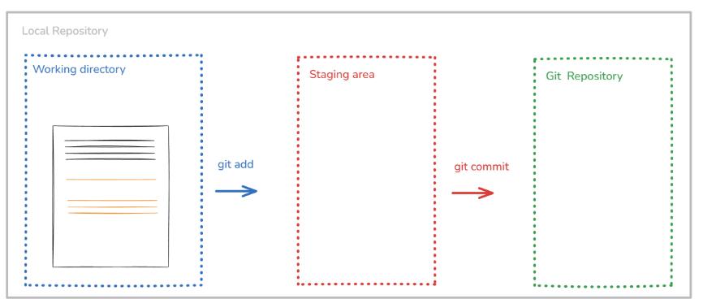
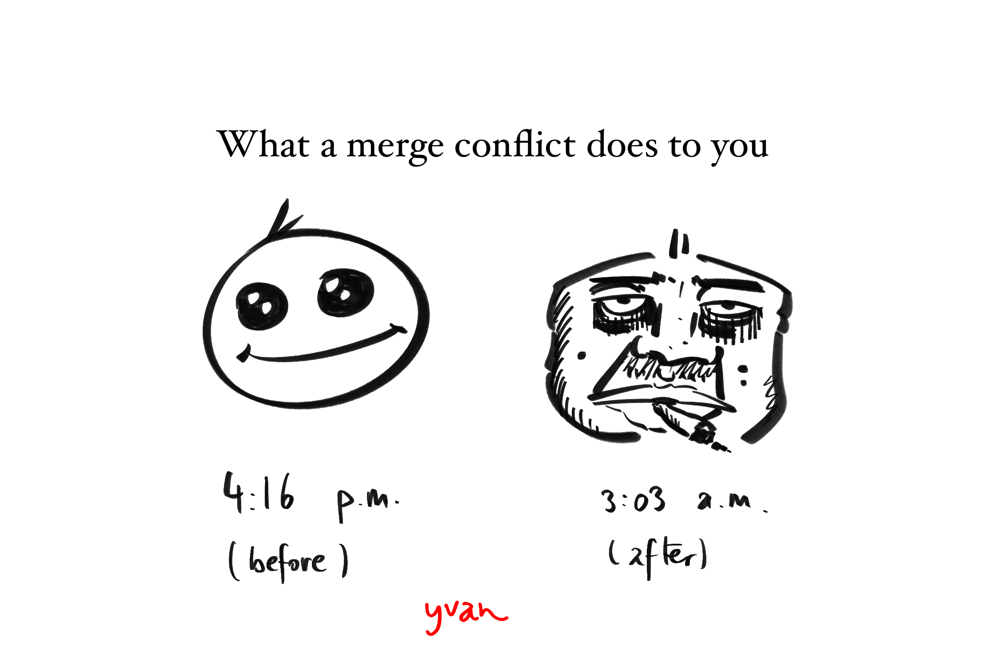

## Foreword

The purpose of this second lecture is to introduce the concept of version control and the tools that are commonly used for it, namely Git and GitHub. The lecture, originally crafted by Dr. Franziska Bender, and Dr. Aurélien Sallin, covers the following topics:

- what is version control
- how to use Git for version control
- how to use GitHub for collaboration

## 1. Git

### 1.1. The Substance of Version Control

Whenever we work on projects, we often make changes to our files. Sometimes, we want to keep track of these changes, revert to previous versions, or collaborate with others without overwriting each other's work. This is where version control systems come in! Git is a popular version control system (VCS) that allows us to manage changes to our files and collaborate with others effectively. Git is probably the most widely used VCS in the world, and it is an essential tool for any programmer or data scientist.

### 1.2. Intuition for Git

A project in Git is called a **repository** (or *repo* if you want to show that you know the lingo).
When we start a new project, we can initialize a Git repository in our project directory. This allows us to track changes to our files and manage our project history.

```bash
# initialize a new Git repository
git init
```

Once we have a Git repository, we have to indicate which files we want to track. We can do this by adding files to the staging area using the `git add` command.

```bash
# add a file to the staging area
git add main.py
```

Once we have staged our changes, we can commit them to the repository using the `git commit` command. A commit is like a snapshot of our project at a specific point in time. It allows us to keep track of our changes and revert to previous versions if needed. Importantly, each commit has a unique identifier (called a hash) that allows us to reference it later and is always attributed to an author and a timestamp.

```bash
# commit our changes with a message
git commit -m "Add main.py with initial code"
```

I recommend using meaningful commit messages that describe the changes you have made. This will make it easier for you and others to understand the history of your project and the purpose of each commit. Here is the structure so far:

{width="50%" fig-align="center"}


At any point in time, we can view our commit history using the `git log` command. This will show us a list of all the commits in our repository, along with their messages, authors, and timestamps. Here is an example from the current project I am working on:

```bash
commit b65ae016204690b81ffc99fae1ecdc4f55cb6dd8
Merge: 8f5b21d b258f76
Author: Yvan Richard <yvan.richard2004@gmail.com>
Date:   Fri May 8 03:09:19 2026 +0200

    resolve quarto render conflicts

commit 8f5b21de47a3979f8f3411ad27ba8138884c9b70
Author: Yvan Richard <yvan.richard2004@gmail.com>
Date:   Fri May 8 03:04:45 2026 +0200

    hash issue fix 1
```

We can also view the changes we have made to our files using the `git diff` command. This will show us a line-by-line comparison of our changes, highlighting what has been added, removed, or modified. I personally do not use this command very often. One that I use extremely frequently is `git status`, which shows us the current state of our repository, including which files are staged, unstaged, or untracked.

```bash
# check the status of our repository
git status
```

and here is an example of the output (from this very project):

```bash
On branch week_02
Changes not staged for commit:
  (use "git add/rm <file>..." to update what will be committed)
  (use "git restore <file>..." to discard changes in working directory)
        modified:   lectures/week_02/summary_02.qmd

Untracked files:
  (use "git add <file>..." to include in what will be committed)
        assets/images/git.png

no changes added to commit (use "git add" and/or "git commit -a")
```

### 1.3. Branching and Merging: A Practical Example

> This example is the result of my own work and is not part of the original lecture.

Let us understand how a branch works in Git. Let us suppose that right now we only have `main` in our repository, which is the default branch that Git creates when we initialize a new repository. We have the following structure:

```txt
o––––––main
```

Now, I decide that I want to create a summary for the lecture of week 02 in `lectures/week_02/summary_02.qmd`. I want to work on this file without affecting the `main` branch, so I create a new branch called `week_02`:

```bash
# create a new branch called week_02 and switch to it
git switch -c week_02
```

and now we have the following structure (I use the `*` symbol to indicate where we are in the schema):

```txt
o––––––main, * week_02
```

Now let us say that I have made some changes to `lectures/week_02/summary_02.qmd` and I want to commit those:

```bash
# add the changes to the staging area
git add lectures/week_02/summary_02.qmd

# commit the changes with a message
git commit -m "Add summary for week 02 lecture"
```

Now we have the following structure with the new commit on the `week_02` branch, where `o` represents a commit
and `a3tf65i` is the hash of the new commit:

```txt
o––––––main
 \
  o (a3tf65i) ––––– * week_02
```

Let us further suppose that I have made some more changes to `lectures/week_02/summary_02.qmd` and I want to commit those as well:

```bash
# add the changes to the staging area
git add lectures/week_02/summary_02.qmd 

# commit the changes with a message
git commit -m "Add more content to week 02 summary"
```

Now we have the following structure with the new commit on the `week_02` branch:

```txt
o––––––main
 \
  o (a3tf65i) ––––– o (b4g5h6i) ––––– * week_02
``` 

But I realize that these changes are actually not good and I want to revert to the previous version of `lectures/week_02/summary_02.qmd` (i.e. the version at the previous commit). I can do this using the `git restore` command:

```bash
# restore the previous version of the file
git restore --source=a3tf65i lectures/week_02/summary_02.qmd
```

In this case, `a3tf65i` is the hash of the commit that we want to restore. This copies the version of `lectures/week_02/summary_02.qmd` from commit `a3tf65i` into the working directory. It does not delete commit `b4g5h6i`; the history remains unchanged until we commit the restored file.

```txt
o––––––main
 \   . – + – + –(we take this version)– +.  
  \ /                                     \
   o (a3tf65i)––––– o (b4g5h6i)–––––––––––– * week_02
``` 

And I can commit this change to the `week_02` branch if I indeed think that the
previous version is better than the current one:

```bash
# add the changes to the staging area
git add lectures/week_02/summary_02.qmd

# commit the changes with a message
git commit -m "Revert changes to week 02 summary"
```

Now we have the following structure with the new commit on the `week_02` branch:
```txt
o––––––main
 \   . – + – + –(we take this version)– +.  
  \ /                                     \
   o (a3tf65i)––––– o (b4g5h6i)–––––––––––– o (c7h8i9j) –––– * week_02
```

So in this case, the content of `lectures/week_02/summary_02.qmd` is the same as in the commit `a3tf65i`, but we have a new commit `c7h8i9j` that indicates that we have reverted the changes. This is one of the powerful features of Git: it allows us to keep track of our changes and revert to previous versions if needed, without losing any history of our project.

Now, let us further suppose that I want to style the scsss file that I am using for the website: `custom.scss`. I create a new branch called `style` to work on this:

```bash
# switch to main
git switch main

# create a new branch called style and switch to it
git switch -c style
```

Now we have the following structure:
```txt
o––––––main, * style
 \   . – + – + –(we take this version)– +.  
  \ /                                     \
   o (a3tf65i)––––– o (b4g5h6i)–––––––––––– o (c7h8i9j) –––– week_02
```

I make some changes to `custom.scss` and commit those:

```bash
# add the changes to the staging area
git add custom.scss

# commit the changes with a message
git commit -m "Add custom styles to the website"
```

Now we have the following structure with the new commit on the `style` branch:
```txt
  o (d8i9j0k) –––– * style
 /
o––––––main
 \   . – + – + –(we take this version)– +.  
  \ /                                     \
   o (a3tf65i)––––– o (b4g5h6i)–––––––––––– o (c7h8i9j) –––– week_02
```

Now that the style changes are ready, I want to merge the `style` branch into the `main` branch. This will allow me to have the new styles in the main branch and make them available for everyone who is using the main branch. I can do this using the `git merge` command:

```bash
# switch to the main branch
git switch main

# merge the style branch into main
git merge style
```

and the structure will now look like this (no new commit is created because we are doing a fast-forward merge, which simply moves the `main` branch pointer to the same commit as `style`. This is possible because there are no new commits on `main` since we branched off `style`):

```txt
  o (d8i9j0k) –––– style, * main
 /                 
o          
 \   . – + – + –(we take this version)– +.  
  \ /                                     \
   o (a3tf65i)––––– o (b4g5h6i)–––––––––––– o (c7h8i9j) –––– week_02
``` 

I can delete the `style` branch after merging it if I no longer need it:

```bash
# delete the style branch
git branch -d style
```

Now we have the following structure and we see that the two branches have different commits!

```txt
o ––––– o (d8i9j0k) –––– * main
 \
  o (a3tf65i) ––––– o (b4g5h6i) ––––– o (c7h8i9j) –––– week_02

```

Now, I also want to merge the `week_02` branch back into `main`, because the week 02 summary is ready and should become part of the main version of the project. At this point, the situation is different from the previous merge. The `main` branch contains the style commit `d8i9j0k`, while the `week_02` branch contains the commits related to the lecture summary. Therefore, the two branches have **diverged**: each branch contains work that the other branch does not yet have.

To merge `week_02` into `main`, I first make sure that I am on `main`:

```bash
# switch to the main branch
git switch main

# merge the week_02 branch into main
git merge week_02
```

If there are no conflicts, Git will create a new merge commit. This merge commit combines the history of `main` and `week_02`.
The structure will then look like this:

```txt
o ––––– o (d8i9j0k) ––––––––––––––––––––––––––– o (m1n2o3p) –––– * main
 \                                             /
  o (a3tf65i) ––––– o (b4g5h6i) ––––– o (c7h8i9j) –––– week_02
```

Here, `m1n2o3p` is the merge commit. It has two parents: the latest commit on `main`, namely `d8i9j0k`, and the latest commit on `week_02`, namely `c7h8i9j`. This is why the diagram shows the two branches joining together.
After the merge, `main` contains both sets of changes: the style changes from `custom.scss` and the week 02 summary from `lectures/week_02/summary_02.qmd`. If I no longer need the `week_02` branch, I can delete it:

```bash
# delete the week_02 branch
git branch -d week_02
```

After deleting the branch pointer, the commits are not deleted. They remain part of the history of `main` through the merge commit. The final structure is:

```txt
o ––––– o (d8i9j0k) ––––––––––––––––––––––––––– o (m1n2o3p) –––– * main
 \                                             /
  o (a3tf65i) ––––– o (b4g5h6i) ––––– o (c7h8i9j)
```

That was quite a bit of Git!

{width="70%" fig-align="center"}


## 2. Self-Study

### 2.1. Additional Git Commands

Here are some additional Git commands that can be useful when working with Git:

| Command | Description |
| --- | --- |
| `git diff --staged` | Show the changes that are staged for the next commit |
| `git log --oneline` | Show the commit history in a compact format |
| `git log --graph` | Show the commit history as a graph |
| `git reset <filename>` | Unstage a file (remove it from the staging area) |   
| `git restore <filename>` | Discard changes to a file in the working directory |
| `git restore --source=<commit> <filename>` | Restore a file to the version in a specific commit |
| `git branch` | List all branches in the repository |


### 2.2. The Anatomy of a Git Command

At first, I found Git commands to be quite cryptic. However, I have come to understand that they are actually quite intuitive once you understand the underlying structure:

```bash
git <command> [options/flags] [arguments]
```

- `git` is the name of the version control system we are using.
- `<command>` is the specific action we want to perform (e.g., `add`, `commit`, `merge`, etc.).
- `[options/flags]` are additional parameters that modify the behavior of the command (e.g., `-m` for commit messages, `--staged` for showing staged changes, etc.).
- `[arguments]` are the specific files, branches, or commits that the command operates on (e.g., `main.py`, `week_02`, `a3tf65i`, etc.).

Importantly, we can always get help on any Git command by using the `-h` or `--help` flag:
```bash
git <command> -h
```
I find `git <command> --help` to be more informative than `git <command> -h`, but both work.

### 2.3. Detached HEAD State

When we check out a specific commit (instead of a branch), we enter what is called a "detached HEAD" state. This means that we are not on any branch, but rather on a specific commit. In this state, if we make changes and commit them, those commits will not be part of any branch and can be easily lost if we switch to another branch. Therefore, it is generally not recommended to work in a detached HEAD state unless you know what you are doing.


